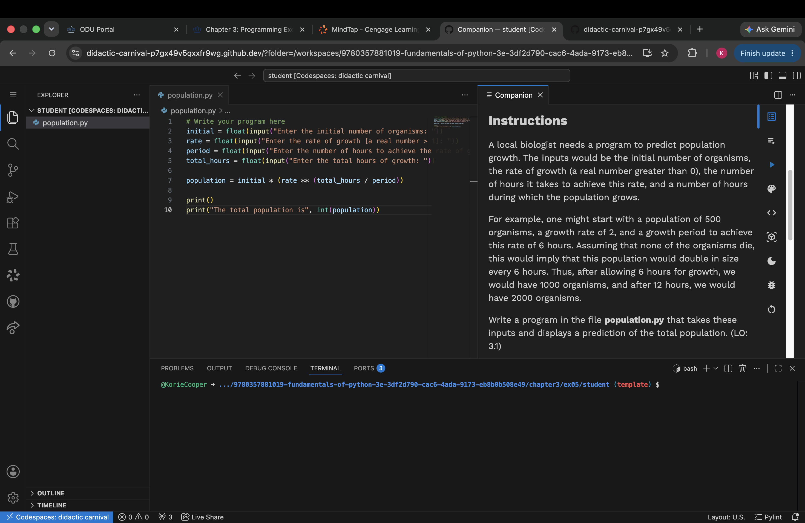

# Learning-Python
A collection of Python projects I've worked on.
## Projects

## Copy File

## Circle Area Calculator

## Decimal to Binary

## Decrypt

## Encrypt

## Equilateral Triangle

## File Diff

## GCD

## Navigate

## Number Lines

## Population

## Rectangle Calculator

## Round Function

## Salary Calculator

## Sum

## Triangle Calculator

## Volume of Cuboid Calculator

